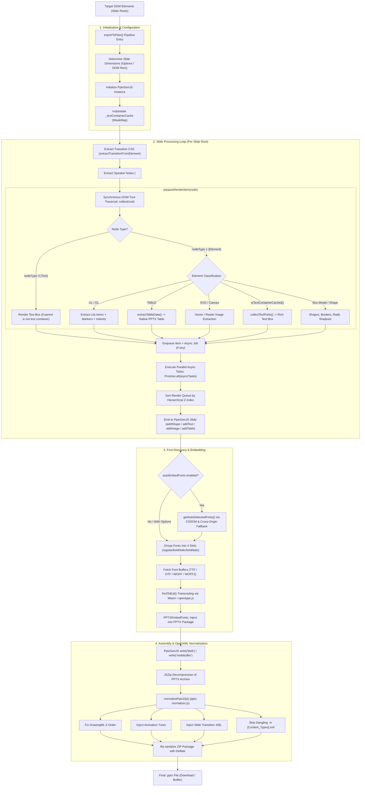
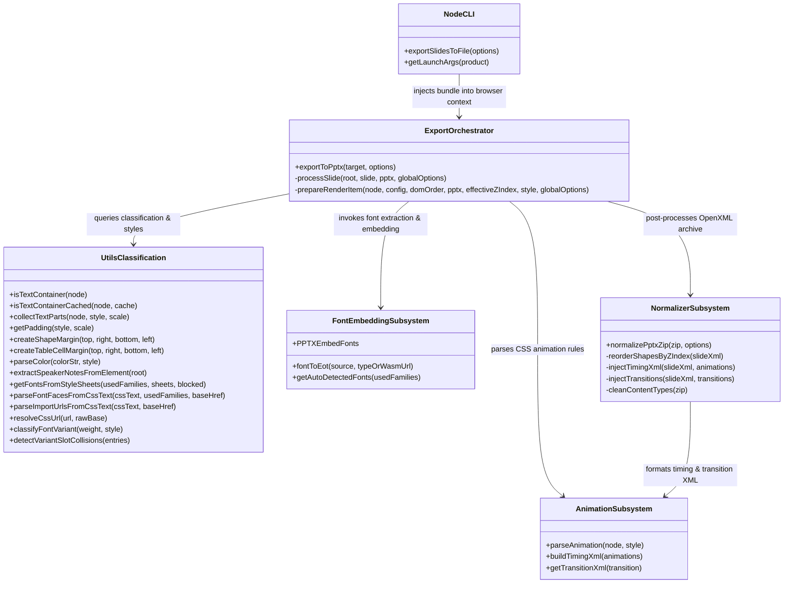

# dom-to-pptx: Architecture Context & Agent Guide

> **Target Audience**: AI coding agents and human contributors working on `dom-to-pptx`.  
> **Repository**: [dom-to-pptx](https://github.com/atharva9167j/dom-to-pptx)  
> **Package Version**: `v2.1.2` (with post-release stability & performance patches)  
> **License**: MIT  

---

## 1. Executive Mission & Philosophy

`dom-to-pptx` translates DOM element trees directly into native, editable Microsoft PowerPoint presentations (`.pptx`).

Unlike screenshot-based export tools (which dump flattened canvas images into slide placeholders), `dom-to-pptx` decomposes the DOM box model into **first-class OpenXML shapes, native text runs, vector geometry, tables, and media**. Text remains selectable and searchable; gradients, borders, box-shadows, and border-radii convert to native PowerPoint DrawingML definitions; CSS animations and transitions map to native PowerPoint slide timing sequences.

---

## 2. System Architecture & End-to-End Pipeline

---

## 3. Subsystem Breakdown

### 3.1. Core Orchestrator (`src/index.js`)
* **`exportToPptx(target, options)`**: Primary entry point. Handles slide dimension negotiation (16:9, 16:10, 4:3, or custom pixel bounds), instantiates `PptxGenJS`, manages per-run caching state (`_textContainerCache`), loops over slides, orchestrates font embedding, invokes the OOXML normalizer, and triggers download or returns the buffer.
* **`processSlide(root, slide, pptx, globalOptions)`**: Synchronously traverses the slide root via `collect()`. Batches async jobs (canvas renders, image data URL fetches) and executes them concurrently using `Promise.all`. Emits sorted items into the PptxGenJS slide instance.
* **`prepareRenderItem(node, config, domOrder, pptx, effectiveZIndex, computedStyle, globalOptions)`**: The core classification engine. Dispatches DOM nodes to their respective shape/text/table/image handlers.

### 3.2. Utility & Classification Engine (`src/utils.js`)
* **`isTextContainer(node)`**: Deep DOM inspector determining whether an element represents an atomic text paragraph/badge or a structural container. Prevents child text elements from rendering as duplicated, overlapping shapes.
* **`collectTextParts(node, style, scale, ...)`**: Walks descendant inline elements (``, `<b>`, `<strong>`, `<em>`, `<a>`, `<mark>`) and builds formatted `textParts` arrays with colors, font sizes, line heights, letter spacing, and bullet configurations.
* **`getPadding(style, scale)`**: Computes CSS top, right, bottom, and left padding scaled to presentation inches.
* **`extractSpeakerNotesFromElement(root)`**: Scans for `<template data-pptx-notes>` or `[data-pptx-notes]` attributes and formats multi-block speaker notes.
* **Font Discovery Suite**:
  * `getFontsFromStyleSheets(usedFamilies, styleSheets, blockedHrefs)`: Recursively scans the CSSOM (including `@import` chains) with cyclic graph protection. Resolves relative font URLs against stylesheet `href`.
  * `parseFontFacesFromCssText(cssText, usedFamilies, baseHref)`: Regex fallback parser for cross-origin stylesheets where CORS blocks direct `cssRules` access. Resolves relative URLs against `baseHref`.
  * `classifyFontVariant(weight, style)`: Maps CSS `font-weight` (>= 600 = bold) and `font-style` (`italic`/`oblique` = italic) into PowerPoint's 4 fixed slots.
  * `detectVariantSlotCollisions(entries)`: Flags design bugs where multiple distinct weights of the same family collide into the same slot.

### 3.3. Font Embedder Subsystem (`src/font-embedder.js`, `src/font-utils.js`, `src/woff2-wasm-base64.js`)
* Converts web fonts (`.woff`, `.woff2`, `.ttf`, `.otf`) into OpenType / EOT binary format compatible with PowerPoint embedded fonts.
* Patches `ppt/presentation.xml` (`<p:embeddedFont>`), `[Content_Types].xml`, and `ppt/_rels/presentation.xml.rels`.

### 3.4. Animation & Transition Subsystem (`src/animations/`)
* **`css-parser.js`**: Parses CSS keyframes, animation names, delays, durations, and iteration counts.
* **`transitions.js`**: Maps CSS transition classes to OpenXML slide transitions (`wipe`, `fade`, `push`, etc.).
* **`xml-templates.js`**: Generates valid DrawingML `<p:timing>` element trees (`<p:tnLst>`, `<p:bldLst>`, `<p:childTnLst>`).

### 3.5. OpenXML Normalizer (`src/pptx-normalizer.js`)
* Raw PptxGenJS output has several critical OOXML non-conformances:
  1. Shapes are appended in call order rather than composite z-index.
  2. Native PowerPoint crashes if `[Content_Types].xml` contains dangling `<Override>` references.
  3. DrawingML `<a:pPr>` paragraph property child elements require strict OpenXML sequence ordering.
* `normalizePptxZip()` performs in-memory ZIP surgery using `JSZip`, rewriting slide XML to enforce correct z-stacking, injecting animation trees, and stripping invalid content types.

### 3.6. Headless Exporter (`src/node-exporter.js`, `bin/cli-exporter.js`)
* Launches Chromium/Edge/Firefox via Puppeteer.
* Uses `--allow-file-access-from-files` so local `file://` decks can load sibling font files.
* Injects `dom-to-pptx.bundle.js` into the page context and saves exported slides directly to disk.

---

## 4. Critical Invariants, Gotchas & Footguns

| Domain | Gotcha / Invariant | Consequence of Missing |
| :--- | :--- | :--- |
| **PptxGenJS Text Insets** | PptxGenJS consumes `margin` for text boxes as `[left, right, bottom, top]` in points: `[lIns, rIns, bIns, tIns]`. | Passing standard CSS `[top, right, bottom, left]` swaps top and left margins, breaking bullet indents and padding alignment. |
| **PptxGenJS Table Cells** | Unlike text boxes, table cell margins in PptxGenJS consume `[top, right, bottom, left]` (`marT = [0]`, `marR = [1]`, `marB = [2]`, `marL = [3]`). | Passing `[lIns, rIns, bIns, tIns]` into table cells inverts vertical and horizontal cell padding. |
| **PowerPoint Font Slots** | Microsoft PowerPoint supports exactly 4 embedded font slots per family: `regular`, `bold`, `italic`, `boldItalic`. | If a deck uses `font-weight: 700` and `font-weight: 900`, both land in the `bold` slot; only one will survive embedding. Workaround: assign separate CSS `font-family` name (e.g. `'Inter Black'`). |
| **Relative Font URLs** | `@font-face { src: url(...) }` in external stylesheets is relative to the *stylesheet*, not the HTML document. | Fetching font URLs without resolving against `sheet.href` or `baseHref` causes 404s in nested asset setups. |
| **OpenXML Sequence Ordering** | In `<a:pPr>`, DrawingML schema strictly dictates child element tag order (e.g., `<a:lnSpc>` before `<a:spcBef>` before `<a:buClr>` before `<a:defRPr>`). | PowerPoint throws "Repairs required" and strips text formatting if child XML tags are written out of sequence. |
| **Inline SVG Tag Names** | In browser DOM, SVG foreign elements retain lowercase tag names (e.g. `svg`, not `SVG`). | Case-sensitive tag comparisons like `el.tagName === 'SVG'` evaluate to `false`, causing inline SVGs to be misclassified as text and dropped. |
| **Text Container Memoization** | Ancestor checks `while (ancestor) isTextContainer(ancestor)` run for every DOM element during slide traversal. | Without caching (`WeakMap`), deeply nested trees trigger quadratic layout style recalcs ($O(N \cdot D)$ `getComputedStyle` calls). |

---

## 5. Architectural Map & Knowledge Graph

