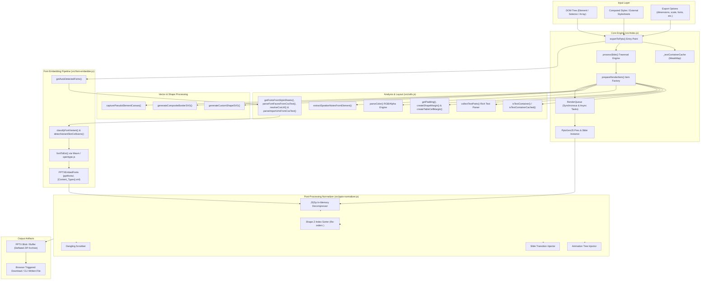

# dom-to-pptx: System Knowledge Graph

This knowledge graph provides structural, relational, and data-flow mappings of the `dom-to-pptx` ecosystem for autonomous agents and developer tooling.

---

## 1. Domain Entity & Component Graph

---

## 2. Component Responsibility Matrix

| Component | Primary File | Input | Output | Upstream Dependencies | Downstream Dependents |
| :--- | :--- | :--- | :--- | :--- | :--- |
| **Orchestrator** | `src/index.js` | DOM Root(s), `options` | PPTX Blob / Buffer | `pptxgenjs`, `jszip` | External Consumers, CLI |
| **DOM Classifier** | `src/utils.js` | Element, ComputedStyle | Boolean, Insets, TextParts | DOM CSSOM | `prepareRenderItem`, `collect` |
| **Shape Factory** | `src/index.js`, `src/utils.js` | Node, Dimensions, Borders | DrawingML Shape / SVG Data URL | `parseColor`, `getPadding` | `PptxGenJS.Slide.addShape` |
| **Font Detector** | `src/utils.js` | `usedFamilies`, CSSOM | Array of Font Variant Objects | `document.styleSheets`, `fetch` | `font-embedder.js` |
| **Font Transcoder** | `src/font-embedder.js` | TTF/OTF/WOFF Buffers | EOT Data, OpenXML Part XML | `opentype.js`, Wasm converter | `JSZip` archive |
| **Normalizer** | `src/pptx-normalizer.js` | JSZip instance, Slide Metadata | Patched OpenXML Archive | `DOMParser`, `XMLSerializer` | Final PPTX Serialization |
| **Headless CLI** | `src/node-exporter.js` | URL / HTML File, CLI flags | `.pptx` File on Disk | `puppeteer`, Chromium/Edge | CLI Users, Automated CI |

---

## 3. Data Invariant & Execution Contracts

1. **State Isolation**: `exportToPptx` allocates an isolated `_textContainerCache: new WeakMap()` per invocation. No classification state leaks across runs or concurrent exports.
2. **Text Box Inset Array Contract**:
   - `pptxgenjs` text shape `margin`: `[lIns, rIns, bIns, tIns]` (in points).
   - `pptxgenjs` table cell `margin`: `[marT, marR, marB, marL]` (in points).
3. **Font Slot Constraint Contract**:
   - PowerPoint OOXML allows only 4 embedded font variations per family name: `regular`, `bold`, `italic`, `boldItalic`.
   - Any secondary bold weight (e.g. 700 and 900) will overwrite the slot unless split into distinct `font-family` aliases.
4. **DrawingML Sequence Contract**:
   - Inside `<a:pPr>`, elements must follow strict schema order (`lnSpc` -> `spcBef` -> `spcAft` -> `buClr` -> `defRPr`). Out-of-order injection triggers OpenXML corruption repair alerts.
